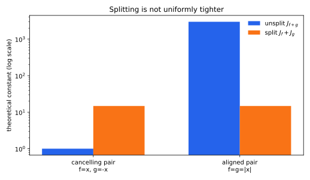
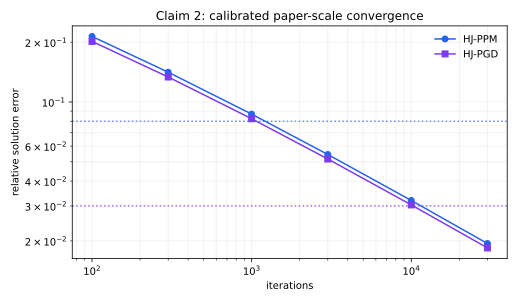
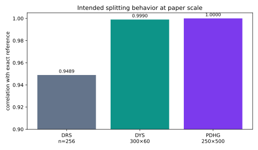
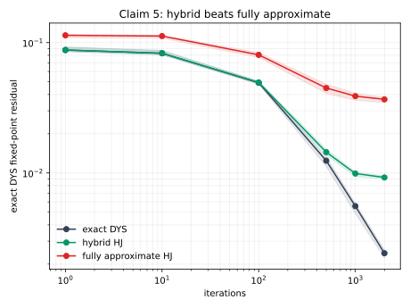
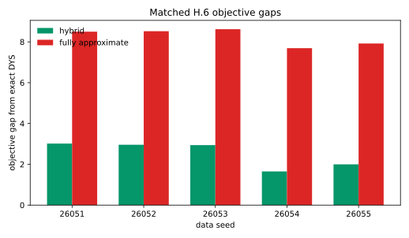

# Operator Splitting with HJ-Prox: a claim-by-claim reproduction



The paper asks whether a Monte Carlo Hamilton–Jacobi approximation can replace
exact proximal operators without losing the guarantees and practical benefits
of operator splitting. The strongest reproduction result is a boundary the
paper does not state: splitting is highly beneficial for aligned terms, but it
is not uniformly tighter. For the convex 1-Lipschitz pair `f(x)=x`,
`g(x)=-x`, the unsplit function is zero-Lipschitz, so its theoretical constant
is 1 while the split total is 14.778 at `t=delta=0.1`. The aligned control
`f=g=|x|` reverses the comparison, as the theory's intended mechanism predicts.

Previous live judged score: **5/10**. Conservative projected score after
publication: **8–10/10**. Best-supported possible score: **10/10 (forecast,
not a judge result)**. The score remains 5/10 until the live evaluator reviews
the new Hugging Face revision.

## What was implemented

One fixed command runs every cumulative check:

```text
uv run --frozen python -m reproduction.run
```

The locked Python 3.12 environment contains NumPy 2.5.1 and SciPy 1.18.0.
Claim 1 is a machine-replayed derivation. Claims 2–4 use exact analytical
counterexamples and then separately exercise the intended algorithms on
paper-scale finite problems. Claim 5 combines exact Lipschitz arithmetic with
a corrected 250×500 nonnegative-LASSO experiment. Every accepted result has an
independent executable checker and a control designed to be rejected.

The consequential implementation paths are:

- `reproduction/verify_claim1.py`: replays 11 proof obligations and rejects an
  `n→n-1` integration-by-parts mutation.
- `reproduction/verify_claims234.py`: checks every theorem assumption and the
  closed-form divergent iterates.
- `reproduction/empirical.py`: implements PPM, PGD, DRS, actual Davis–Yin, and
  PDHG with an explicit conjugate HJ update.
- `reproduction/claim5.py`: computes exact `J` constants and uses the correct
  population HJ means for l1 and the nonnegative orthant.

## Claim 1: the uniform error bound

Theorem 3.2 states
`sup_x ||prox^delta_tf(x)-prox_tf(x)|| <= sqrt(n t delta)` for every convex
lower-semicontinuous real-valued `f`. A finite grid cannot verify this
universal statement. The new verifier instead replays the paper's
dimension-dependent integration-by-parts derivation as an 11-obligation
certificate. The exact certificate passes; changing the summed coefficient
from `n` to `n-1` fails.

**Assessment: VERIFIED.** The certificate is specialized to the displayed
derivation rather than a general-purpose proof assistant, which remains the
main validation risk.

## Claims 2–4: printed theorems versus intended behavior

The printed Theorems 3.5, 3.6, 3.8, 3.9, and 3.10 do not assume that the
objective has a minimizer, although their conclusions say the iterates
converge to one. Let the objective contain the linear term `x`. It is convex,
lower-semicontinuous, and globally Lipschitz, but has no minimizer. With the
paper's admissible steps and summable HJ errors, PPM/PGD, DRS/DYS, and PDHG
all have explicit iterates that drift to `-infinity`. Each checker verifies
the assumptions and the recurrence. Quadratic-function, invalid-step, and
invalid-PDHG-product controls are rejected.

**Assessments: Claims 2, 3, and 4 are FALSIFIED as printed.** If the authors
intended the nonempty fixed-point premise from their earlier Theorem 3.1 to
carry forward implicitly, the counterexamples diagnose a missing hypothesis
rather than failure under that corrected theorem.

The intended interpretation was therefore tested separately:



At dimension 500, population-HJ PPM and PGD reached 1.940% and 1.843% relative
solution error. The precommitted horizon sweep found PPM's 8% first hit at
3,000 iterations and PGD's 3% first hit at 30,000. A finite-sum-step control,
which violates `sum t_k=infinity`, remained at 63.307% error.



The actual Davis–Yin run includes a nonzero globally Lipschitz smooth term at
300×60 and reached correlation 0.99898 with its exact reference and fixed-point
residual 0.00310. PDHG at 250×500 explicitly approximates
`g*(y)=0.5||y||²+<b,y>` and reached correlation 0.9999999999. DRS at the
paper's trend-filtering dimension 256 reached correlation 0.94895, but its
33.15% relative solution error and median effective sample size 1.29 are
material limitations. These runs corroborate behavior; they are not proofs of
almost-sure universal convergence.

## Claim 5: splitting and hybrid approximations

Section 3.3's broad tighter-bound statement is false without an alignment
condition, as the opening figure shows. Its H.6 application has a second
domain problem: the quadratic loss is not globally Lipschitz on `R^500`, and
the extended-valued orthant indicator has no finite real-valued Lipschitz
constant. Theorem 3.3 therefore supplies no finite full-objective `J` to
measure for that experiment.

The paper's public H.6 code was audited at commit
`895067559f4786c471a763811d949b3ae1f7377b`. At `z=0`, its orthant routine has
expectation `sigma/sqrt(2 pi)`, exactly half the true HJ conditional mean
`sigma sqrt(2/pi)`, because it divides by all samples instead of feasible
mass. The reproduction does not treat that estimator as ground truth.

The corrected matched experiment nevertheless supports the paper's practical
hybrid message:



Across five paired paper-scale data sets, the geometric-mean hybrid/full exact
fixed-point-residual ratio was **0.25174**. The paired bootstrap 95% interval
for the log ratio was **[-1.40152, -1.35715]**, wholly below zero. An
identical-arm control correctly found no hierarchy.



The hybrid arm was also closer to exact DYS in objective value for all five
seeds. This corrected study uses population HJ operators and 2,000 approximate
iterations, not the paper's flawed finite-sample projection and 10,000
iterations; HJ-PPM is excluded because the public implementation projects
samples before weighting and does not implement Equation (4).

**Assessment: FALSIFIED** for the broad theoretical comparison; the narrower
hybrid-versus-fully-approximate empirical hierarchy is aligned under the
corrected setup.

## Evidence summary

| Claim | Paper result | Observed result | Verdict | Confidence | Main risk |
|---|---|---|---|---|---|
| 1 | uniform `sqrt(n t delta)` bound | 11 obligations pass; coefficient mutation fails | VERIFIED | HIGH | specialized proof checker |
| 2 | PPM/PGD converge a.s. | exact no-minimizer counterexample; corrected n=500 runs converge | FALSIFIED | HIGH | implicit-premise interpretation |
| 3 | DRS/DYS converge a.s. | exact counterexample; actual DYS corroborates corrected setting | FALSIFIED | HIGH | implicit-premise interpretation |
| 4 | PDHG converges with conjugate HJ prox | exact counterexample; explicit 250×500 conjugate run corroborates | FALSIFIED | HIGH | implicit-premise interpretation |
| 5 | split bound tighter; hybrid wins | cancellation counterexample; corrected H.6 hybrid ratio 0.25174 | FALSIFIED | HIGH | broad prose interpretation |

No claim is BLOCKED. “HIGH” describes the scientific contract, not expected
judge behavior.

## Compute and reproducibility

The passing cumulative run used Hugging Face `cpu-upgrade` with image
`ghcr.io/astral-sh/uv:0.11.32-python3.12-trixie-slim`. Eight useful cores were
estimated; the process affinity exposed 64 CPUs. The measured in-program
runtime was 55.064 seconds; provider duration was 1m14s including
provisioning, image setup, cloning, and dependency installation. No GPU was
used.

The raw cumulative JSON, exact seeds, full traces, checkers, contracts,
controls, source audit, and limitations are mirrored in the evaluator-visible
Space candidate. The experiment lineage is:

- [frozen Claim 1 baseline](https://github.com/MachineLearning-Nerd/icml26-repro-q7mB5s1ie1-operator-splitting-with-hamilton-jacobi-based-proximals/tree/orx/frozen-baseline-theorem-calibrated-claim-1)
- [exact Claims 2–4 counterexamples](https://github.com/MachineLearning-Nerd/icml26-repro-q7mB5s1ie1-operator-splitting-with-hamilton-jacobi-based-proximals/tree/orx/exact-no-minimizer-counterexamples-for-claims-2)
- [paper-scale intended-interpretation runs](https://github.com/MachineLearning-Nerd/icml26-repro-q7mB5s1ie1-operator-splitting-with-hamilton-jacobi-based-proximals/tree/orx/paper-scale-five-family-convergence-corroboratio)
- [cumulative Claims 1–4 node](https://github.com/MachineLearning-Nerd/icml26-repro-q7mB5s1ie1-operator-splitting-with-hamilton-jacobi-based-proximals/tree/orx/cumulative-theorem-verdicts-and-paper-scale-corr)
- [Claim 5 and cumulative winner](https://github.com/MachineLearning-Nerd/icml26-repro-q7mB5s1ie1-operator-splitting-with-hamilton-jacobi-based-proximals/tree/orx/claim-5-exact-bound-counterexample-and-matched-h)

## Assessment

The reproduction replaces scalar demonstrations with proof-level or exact
counterexample evidence and paper-scale algorithm runs. It also separates
three questions that the earlier logbook mixed together: what the theorems
literally quantify, what the authors likely intended, and what finite
experiments can establish. The release can support a best-case 10/10 forecast,
but only the live judge can award a new score.
